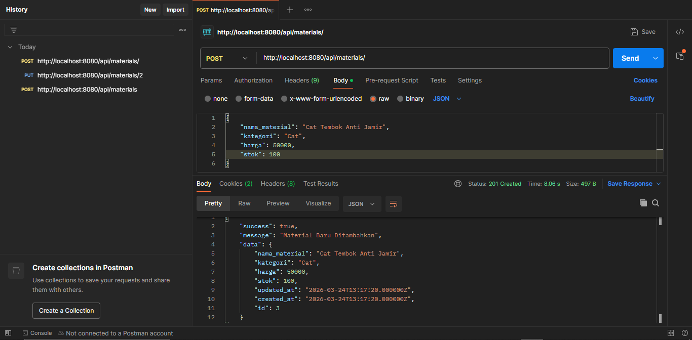
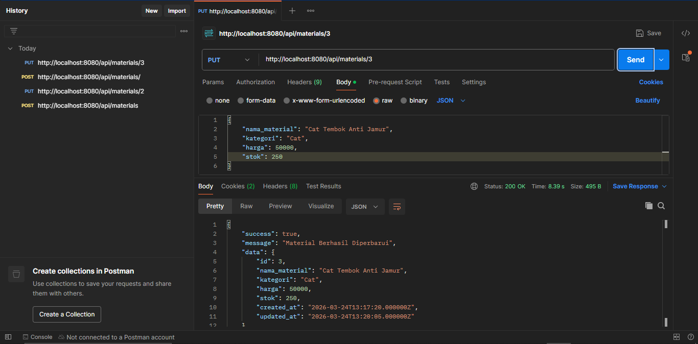
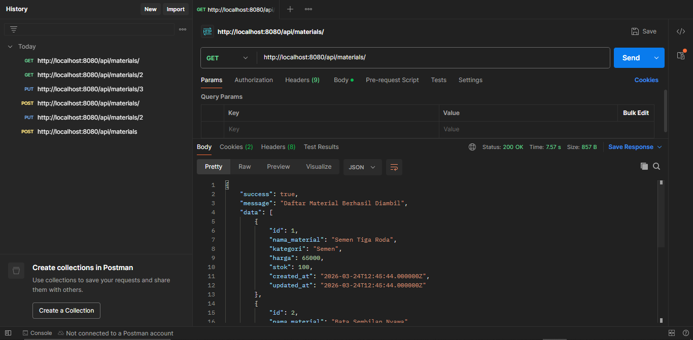
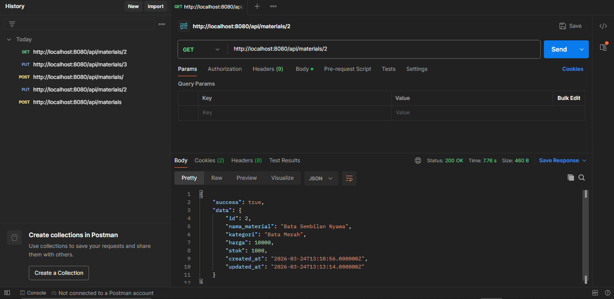
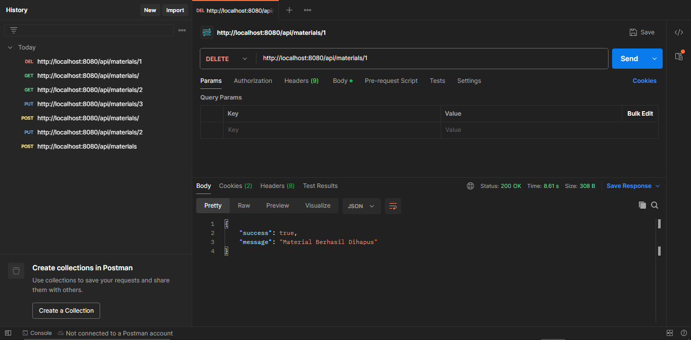

# API Manajemen Inventori Material Bangunan

[](https://github.com/NaqiyyahZhahirah/material-api/actions)

## 1. Deskripsi Project
Project ini adalah **API Manajemen Inventori Material** yang dibangun menggunakan framework Laravel. API ini memungkinkan pengguna untuk mengelola data stok material (Semen, Pasir, Baja, dll) secara digital melalui operasi CRUD (Create, Read, Update, Delete). Seluruh infrastruktur dijalankan di atas Docker untuk memastikan lingkungan pengembangan yang konsisten.

---

## 2. Dokumentasi API

### Endpoint List
| Method | Endpoint | Fungsi |
| :--- | :--- | :--- |
| **GET** | `/api/materials` | Mengambil semua daftar material |
| **POST** | `/api/materials` | Menambah material baru ke database |
| **GET** | `/api/materials/{id}` | Melihat detail satu material spesifik |
| **PUT** | `/api/materials/{id}` | Memperbarui data material (stok/harga) |
| **DELETE** | `/api/materials/{id}` | Menghapus data material dari sistem |

### Format Response
**Success (201 Created / 200 OK):**
```json
{
    "success":true,
    "message":"Material Baru Ditambahkan",
    "data": 
    {
        "nama_material":"Cat Tembok Anti Jamir",
        "kategori":"Cat",
        "harga":50000,
        "stok":100,
        "updated_at":"2026-03-24T13:17:20.000000Z",
        "created_at":"2026-03-24T13:17:20.000000Z",
        "id":3
    }
}
```
**Error (422 Unprocessable Entity - Validasi Gagal):**
```json
{
    "message": "The nama material field is required. (and 3 more errors)",
    "errors": {
        "nama_material": [
            "The nama material field is required."
        ],
        "kategori": [
            "The kategori field is required."
        ],
        "harga": [
            "The harga field is required."
        ],
        "stok": [
            "The stok field is required."
        ]
    }
}
```

## 3. Panduan Instalasi (Docker)
Langkah-langkah Menjalankan Aplikasi:
Clone Repository:

Bash
git clone [https://github.com/NaqiyyahZhahirah/material-api]
cd material-api
Build & Run Container:

Bash
docker-compose up -d --build
Konfigurasi Database & Key:

Bash
docker-compose exec app php artisan key:generate
docker-compose exec app php artisan migrate

Informasi Port:
- Host Port: 8080 (Akses API via http://localhost:8080)
- Container Port: 80 (Nginx/App)
- Database Port: 3306 (MySQL)

## 4. Alur Kerja Git
Branching Strategy:
Project ini menggunakan tiga jenis branch utama untuk manajemen kode yang rapi:
- main: Branch stabil untuk pengumpulan tugas akhir.
- develop: Branch integrasi fitur sebelum digabungkan ke branch utama.
- feature/material-crud: Branch khusus untuk proses pengembangan fitur CRUD.

Conventional Commits:
Riwayat commit mengikuti standar industri untuk memudahkan pelacakan perubahan:
- feat: Digunakan saat penambahan fitur baru (Material CRUD).
- fix: Digunakan saat perbaikan bug (Update method issue).
- docs: Digunakan untuk perubahan pada dokumentasi (README).
- chore: Digunakan untuk pembaruan konfigurasi (Docker/GitHub Actions).

## 5. Status Automasi (GitHub Actions)
Aplikasi ini dilengkapi dengan CI/CD Workflow yang berjalan otomatis setiap kali ada push atau pull request:
- CI (Continuous Integration): Melakukan instalasi dependencies, pengecekan sintaks PHP, dan menjalankan Automated Testing menggunakan SQLite sebagai database testing untuk memastikan fungsionalitas API tetap aman.
- Status Badge: Status automasi dapat dilihat pada bagian atas. Jika sudah ada centang berwarna hijau (passing), berarti aplikasi lulus uji coba otomatis.

---

## 📸 Bukti Testing (Postman)

Berikut adalah bukti dokumentasi hasil pengujian API menggunakan Postman:

### 1. Menambah Data (POST)
**Endpoint:** `POST /api/materials`

*Berhasil menambahkan material baru ke database.*

### 2. Mengubah Data (PUT)
**Endpoint:** `PUT /api/materials/{id}`

*Berhasil memperbarui data material berdasarkan ID.*

### 3. Mengambil Semua Data (GET)
**Endpoint:** `GET /api/materials`

*Berhasil menampilkan seluruh daftar material yang tersedia.*

### 4. Mengambil Detail Data (GET BY ID)
**Endpoint:** `GET /api/materials/{id}`

*Berhasil menampilkan informasi detail satu material.*

### 5. Menghapus Data (DELETE)
**Endpoint:** `DELETE /api/materials/{id}`

*Berhasil menghapus data material dari sistem.*

---